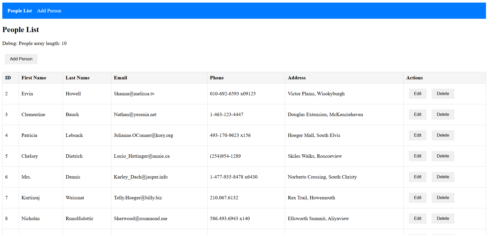

#  People Management App - Simple Angular SPA

A simple Single Page Application (SPA) to manage a list of people. This project demonstrates basic CRUD operations using Angular.

---

##  Tech Stack
- **Frontend**: Angular 12.2.0  
- **Language**: TypeScript 4.3.0  
- **HTTP Client**: Angular HttpClient  
- **Forms**: Angular Forms  
- **Routing**: Angular Router  
- **API**: JSONPlaceholder (for demo)  
- **Build Tool**: Angular CLI 12.2.0  

---

##  Features
-  List all people  
-  Edit person details  
-  Delete person  
-  Add new person  

---

## 📸 Screenshot

---

## ⚙️ Setup

### 1️ Install dependencies
npm install

### 2️ Start the app
npm start

### 3️ Open in browser
http://localhost:4200

---

##  Project Structure

src/app/
├── app.module.ts           # Main module with routing
├── app.component.ts        # Root component
├── app.component.html      # Navigation + router outlet
├── person.service.ts       # Service + interfaces
├── list/
│   ├── list.component.ts   # List logic
│   └── list.component.html # List UI
└── edit/
    ├── edit.component.ts   # Add/Edit logic
    └── edit.component.html # Form UI

---

##  API Used

https://jsonplaceholder.typicode.com/users  

 Note:  
- Data is not actually saved  
- POST/PUT/DELETE are simulated only  

---

##  Key Concepts Covered
- Angular Components  
- Services & Dependency Injection  
- Routing & Navigation  
- Template-driven Forms  
- HTTP API Integration  
- Data Transformation (API to UI Model)  

---
